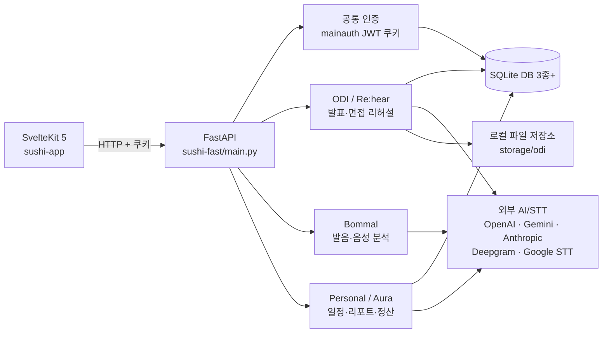

# SUSHISITE 프로젝트 온보딩 가이드

> 분석 기준: 2026-08-04, `main` 브랜치 (`bdc22c7`)  
> 이 문서는 저장소의 실행 코드, 설정, 라우트, DB 스키마, 테스트 및 기존 문서를 기준으로 작성했다.

## 1. 한 문장으로 설명하면

SUSHISITE는 **발표·면접 리허설(ODI/Re:hear), 한국어 발음 분석(Bommal), 강사의 일정·클리닉 리포트 관리(Personal/Aura)**를 한 저장소에서 실험하고 개발하는 웹 서비스 모노레포다.

아직 하나의 완성된 제품으로 정리된 상태라기보다는, 세 제품 축과 여러 프로토타입이 한 SvelteKit 프런트엔드와 한 FastAPI 백엔드에 모여 있는 개발 단계의 저장소에 가깝다.

## 2. 전체 구조



### 루트 디렉터리

| 경로 | 역할 | 상태 |
|---|---|---|
| `sushi-app/` | Svelte 5 + SvelteKit 2 프런트엔드 | 주 프런트엔드 |
| `sushi-fast/` | FastAPI 백엔드 | 주 백엔드 |
| `app.py` | 별도의 단일 파일 일정 CRUD 예제 | 현재 주 앱과 연결되지 않은 프로토타입 |
| `연습.ipynb` | 루트 실험 노트북 | 제품 실행과 무관 |

저장소에는 약 1,155개의 추적 파일이 있으며, 그중 약 753개는 JSON·SVG·이미지·노트북 같은 자산/데이터다. 특히 `sushi-app/src/routes/odi/GITA/.../Icons`와 `sushi-fast/odi/evc_logs`가 파일 수를 크게 늘린다.

## 3. 실제 실행 진입점

### 프런트엔드

- 진입 디렉터리: `sushi-app/`
- 개발 서버: Vite/SvelteKit, 기본 포트 `5173`
- 배포 어댑터: `@sveltejs/adapter-vercel`
- 전역 훅:
  - `src/hooks.ts`: Paraglide 다국어 URL 정규화
  - `src/hooks.server.ts`: Paraglide 미들웨어와 Better Auth 세션 처리
- 루트 `/`는 아직 SvelteKit 기본 환영 화면이다. 실제 기능은 `/odi`, `/bommal`, `/personal-project/...`에서 시작한다.

### 백엔드

- 진입 파일: `sushi-fast/main.py`
- 개발 서버: FastAPI/Uvicorn, 일반적으로 포트 `8000`
- 등록 라우터:
  - `/auth/*`: 공통 회원가입·로그인·JWT
  - `/odi/*`: ODI 사용자, 템플릿, 세션, 파일, EVC
  - `/pronunciation/*`: 발음 분석
  - `/api/personal/*`: 개인 캘린더와 Aura
- CORS 허용 개발 주소: `http://localhost:5173`, `http://localhost:9000` 및 Cloudflare Tunnel 일부

루트의 `app.py`도 FastAPI 앱이지만 `schedule.db`를 사용하는 독립 일정 CRUD 샘플이다. 전체 서비스를 실행할 때는 이것이 아니라 **`sushi-fast/main.py`의 `app`**을 사용해야 한다.

## 4. 제품 영역별 이해

### 4.1 ODI / Re:hear — 발표·면접 리허설

사용자가 발표 또는 면접 환경을 설정하고 자료를 업로드한 뒤, 외부 VR/리허설 흐름과 연동해 세션 및 피드백을 저장하는 기능이다.

주요 프런트 코드:

- `src/routes/odi/+layout.svelte`: 공통 내비게이션과 접근 제어
- `src/routes/odi/+page.svelte`: ODI 홈/대시보드
- `src/routes/odi/session/presentation/*`: 발표 설정 단계
- `src/routes/odi/session/interview/*`: 면접 설정 단계
- `src/routes/odi/report/[session_id]/+page.svelte`: 세션 리포트
- `src/lib/odi/stores/`: 사용자, 템플릿, 세션, 파일 상태와 API 호출
- `src/lib/odi/components/`: 로그인, 설정 카드, 내비게이션, 리포트 UI

백엔드 흐름:

1. 공통 `mainauth` 쿠키로 기본 사용자를 확인한다.
2. ODI에 별도 가입하면 `odi.db`의 `users`에 공통 인증 ID를 연결하고 `odi_token` 쿠키를 발급한다.
3. 발표/면접 설정은 `recent_template`에 저장된다.
4. 세션 시작 시 템플릿 스냅샷과 4자리 PIN을 가진 `pre_session`을 만든다.
5. 외부 클라이언트가 상태/피드백을 갱신하면 최종 `session`과 리포트가 생성된다.

핵심 DB 테이블은 `users`, `templates`, `pre_sessions`, `sessions`다. 템플릿과 피드백은 유연성을 위해 JSON 문자열로 저장한다.

파일 업로드는 `sushi-fast/storage/odi/users/{user_id}/...` 아래에서 관리한다. 슬라이드·논문은 PDF, 스크립트는 TXT/MD를 허용하며 PDF는 PyMuPDF로 페이지 이미지화할 수 있다.

#### EVC(가상 청중 상태) 엔진

`sushi-fast/odi/EVC/`는 발표 음성 구간을 분석해 청중의 세 축을 갱신한다.

- E: 참여도(Engagement)
- V: 평가적 정서(Evaluative Valence)
- C: 인지적 명료성(Cognitive Clarity)

Deepgram STT 결과, 발화 속도·휴지·반복어 등의 음성 지표, 현재 슬라이드, OpenAI의 구간 평가를 결합해 다음 청중 행동을 만든다. 현재 EVC 세션은 프로세스 메모리의 딕셔너리에 있으므로 서버 재시작 시 사라진다. 디버그 로그는 기본값이 활성화되어 `evc_logs`에 기록된다.

`src/routes/odi/GITA/`와 `odi/EVC/EVCv1/`은 현재 구조와 나란히 존재하는 이전/디자인 실험 계열이다. 새 기능을 추가하기 전에 어느 화면 계열을 유지할지 확인해야 한다.

### 4.2 Bommal — 발음·음성 분석

`/bommal`에서 녹음 파일을 받아 한국어 문장 또는 모음 발음을 평가한다.

주요 코드:

- 프런트: `src/lib/bommal/`, `src/routes/bommal/+page.svelte`
- API 라우터: `sushi-fast/Legendaryvowels/router.py`
- STT 추상화: `Legendaryvowels/services/stt/`
- 문장 정렬·채점: `Legendaryvowels/services/sentence/`
- LPC/포먼트 분석: `Legendaryvowels/services/pronunciation/`
- 기준 발음 데이터: `Legendaryvowels/reference_lpc/*.json`

주요 API:

| API | 기능 |
|---|---|
| `GET /pronunciation/health` | 상태 확인 |
| `POST /pronunciation/analyze` | 교육/발표 모드 통합 음성 분석 |
| `POST /pronunciation/sentence` | 레거시 문장 발음 분석 |
| `POST /pronunciation/word` | 모음 단위 LPC 유사도 평가 |

문장 분석은 STT 텍스트를 목표 문장과 음절/단어 단위로 정렬하고, 정확도·발화 속도·침묵·유창성을 계산한다. 기본 STT는 Deepgram이며 선택적으로 Google STT를 2차 검증에 쓴다. 단어 분석은 오디오의 LPC와 저장된 기준 LPC를 비교한다.

더 자세한 알고리즘 설계는 `sushi-fast/Legendaryvowels/ANALYSIS_AND_DESIGN.md`를 참고한다.

### 4.3 Personal / Aura — 강사 운영 도구

공통 JWT 사용자를 기준으로 개인 일정과 클리닉 운영을 관리한다. `/personal-project`는 `/personal-project/calendar`로 이동한다.

주요 기능:

- 월간/주간 개인 캘린더
- 반복 일정과 “이 일정만/이후 일정” 수정·삭제
- 학교 우선순위와 학기 종료 상태
- 학교별 클리닉 회차 및 학생 이름 관리
- 리포트 기본 양식, 임시 저장, 제출
- Gemini/OpenAI/Anthropic 기반 구조화 리포트 생성 및 결과 재사용
- PDF 생성, 모바일 파일 공유, 카카오 연결
- 월별 정산과 XLSX 내보내기

주요 프런트 코드:

- `src/routes/personal-project/calendar/`: 일정 화면
- `src/routes/personal-project/aura/`: 대시보드, 학교, 정산
- `src/routes/personal-project/aura/reports/[targetId]/`: AI 리포트 편집/내보내기
- `src/lib/personal-project/shared/api.ts`: 타입이 지정된 API 클라이언트
- `src/lib/textediter/`: 재사용 가능한 블록형 텍스트 에디터

백엔드는 `personal_project/router.py → repository.py → db.py`의 비교적 명확한 계층으로 구성된다. `personal_project.db`는 모듈 import 시 자동 생성/마이그레이션된다. 학교·회차·대상·리포트·점수 양식·AI 생성 설정·카카오 OAuth 상태까지 모두 이 DB에 저장된다.

기존의 학생 회원 중심 `aura_students/aura_sessions/aura_reports`와, 현재 주력으로 보이는 학교 중심 `aura_schools/aura_clinic_rounds/aura_round_targets/aura_target_reports`가 함께 남아 있다.

## 5. 인증이 두 종류인 이유

이 저장소에는 서로 다른 인증 구현이 공존한다.

1. **실제 제품 기능에서 사용하는 FastAPI 인증**
   - `sushi-fast/auth/`
   - bcrypt + pepper로 비밀번호 해시
   - python-jose JWT를 `mainauth` HttpOnly 쿠키에 저장
   - ODI와 Personal/Aura가 이 인증을 사용

2. **SvelteKit 생성 템플릿의 Better Auth 데모**
   - `sushi-app/src/lib/server/auth.ts`
   - Drizzle + 별도 SQLite
   - `/demo/better-auth`에서 사용
   - 현재 ODI/Personal의 주 인증 경로와 연결되지 않음

신규 제품 코드는 어떤 인증을 표준으로 삼을지 먼저 합의해야 한다. 현재 동작 흐름을 따라간다면 FastAPI의 `mainauth`가 기준이다.

## 6. 로컬 실행 방법

현재 저장소만 clone해서 바로 실행되지는 않는다. 아래 절차와 함께, 팀에서 실제 `.env`, 인증 DB 스키마, Python 의존성 명세를 받아야 한다.

### 6.1 프런트엔드

요구 사항: Node.js와 npm. 정확한 Node 버전은 저장소에 고정되어 있지 않다.

```powershell
cd sushi-app
npm install
Copy-Item .env.example .env
npm run dev
```

`.env`에는 기존 예제 값 외에 대부분의 실제 API 클라이언트가 사용하는 다음 값이 필요하다.

```dotenv
VITE_SUSHIFASTURL=http://localhost:8000
VITE_API_BASE_URL=http://localhost:8000
DATABASE_URL=local.db
ORIGIN=http://localhost:5173
BETTER_AUTH_SECRET=<32자 이상의 충분히 무작위인 값>
```

`VITE_API_BASE_URL`은 현재 레거시 `setup/report` API에서만 사용하고, ODI·Bommal·Personal은 주로 `VITE_SUSHIFASTURL`을 사용한다.

### 6.2 백엔드

Python 3.11 이상을 권장한다. 백엔드 전체 의존성 파일은 현재 없으므로 아래 목록은 import 분석을 바탕으로 한 최소 후보이며, 팀의 확정된 환경을 우선한다.

```text
fastapi, uvicorn, python-dotenv, pydantic, python-multipart,
python-jose, bcrypt, deepgram-sdk, openai, numpy, pymupdf
```

Google STT를 쓸 때는 `google-cloud-speech`가 추가로 필요하다.

```powershell
cd sushi-fast
python -m uvicorn main:app --reload --port 8000
```

FastAPI 문서는 서버 실행 후 `http://localhost:8000/docs`에서 확인할 수 있다.

ODI DB는 자동 초기화되지 않으므로 최초 한 번 다음 API가 필요하다.

```powershell
Invoke-RestMethod -Method Post http://localhost:8000/odi/db/init
```

### 6.3 백엔드 환경 변수

| 영역 | 변수 | 설명 |
|---|---|---|
| 공통 인증 | `JWT_SECRET_KEY`, `ALGORITHM`, `Pepper` | JWT 서명, 알고리즘(예: HS256), 비밀번호 pepper |
| 이메일 인증 | `MAIN_MAIL`, `GOOGLEPASSWORD` | SMTP 발신 계정과 앱 비밀번호 |
| 발음/STT | `DEEPGRAM_API_KEY` | 기본 STT |
| 발음/STT 선택 | `PRONUNCIATION_STT_PROVIDER`, `DEEPGRAM_PRIMARY_MODEL` | 기본값은 deepgram / nova-3 |
| STT 검증 | `STT_VERIFICATION_ENABLED`, `STT_VERIFICATION_PROVIDER`, `DEEPGRAM_VERIFICATION_MODEL`, `GOOGLE_STT_MODEL`, `GOOGLE_STT_LANGUAGE_CODE` | 선택적 2차 검증 |
| STT 임계값 | `STT_VERIFICATION_MIN_AVERAGE_CONFIDENCE`, `STT_VERIFICATION_MIN_TARGET_SIMILARITY` | 검증 실행 조건 |
| LPC | `PRONUNCIATION_EVALUATOR`, `PRONUNCIATION_REFERENCE_DIR` | 평가기와 기준 데이터 경로 |
| EVC | `OPENAI_API_KEY`, `OPENAI_EVC_MODEL` | 구간 평가 모델 |
| EVC 디버그 | `DEBUG_EVC_LOG`, `EVC_DEBUG_LOG_DIR`, `EVC_UPLOAD_DIR` | 로그/업로드 경로 |
| Aura AI | `GEMINI_API_KEY`, `OPENAI_API_KEY`, `ANTHROPIC_API_KEY` | 리포트 모델별 키 |
| Kakao | `KAKAO_REST_API_KEY`, `KAKAO_CLIENT_SECRET`, `KAKAO_REDIRECT_URI` | OAuth/공유 |
| 리다이렉트 | `FRONTEND_URL` | Kakao 콜백 후 이동할 프런트 주소 |

비밀값을 커밋하면 안 된다. 루트 `.gitignore`는 `.env`와 DB 파일을 제외한다.

## 7. 데이터와 상태 저장 위치

| 데이터 | 위치 | 초기화 |
|---|---|---|
| 공통 사용자/이메일 인증 | `sushi-fast/DB/sushiusers.db` | 스키마/초기 DB가 저장소에 없음 |
| ODI 사용자·템플릿·세션 | `sushi-fast/odi/db/odi.db` | `POST /odi/db/init` 필요 |
| Personal/Aura | `sushi-fast/personal_project/personal_project.db` | import 시 자동 |
| Better Auth 데모 | `sushi-app/${DATABASE_URL}` | Drizzle 명령 사용 |
| ODI 업로드 | `sushi-fast/storage/odi/` | 요청 시 디렉터리 생성 |
| EVC 런타임 세션 | Python 프로세스 메모리 | 재시작 시 소실 |

DB와 업로드 파일은 Git에서 제외된다. 개발 DB를 공유할 때는 개인정보와 API 토큰 포함 여부를 반드시 확인한다.

## 8. 자주 쓰는 명령

`sushi-app/`에서 실행한다.

```powershell
npm run dev             # 개발 서버
npm run check           # Svelte/TypeScript 검사
npm run lint            # Prettier + ESLint 검사
npm run test:unit       # Vitest
npm run test:e2e        # Playwright
npm run test            # unit + e2e
npm run storybook       # 컴포넌트 카탈로그
npm run build           # Vercel용 프로덕션 빌드
npm run db:push         # Better Auth 데모 DB 스키마 반영
```

백엔드의 자동화 테스트는 현재 `Legendaryvowels/tests/test_sentence_analysis.py`와 Aura AI 리포트 실험 테스트 위주다. 통합 테스트와 API 인증 테스트는 거의 없다.

## 9. 현재 확인된 주의사항

신규 참여자가 코드를 “완성된 운영 서비스”로 가정하지 않도록 특히 주의할 부분이다.

1. **백엔드 의존성 명세가 없다.** `requirements.txt`/`pyproject.toml`을 만들고 버전을 고정하는 작업이 우선순위가 높다.
2. **공통 인증 DB 스키마가 없다.** `auth/userdb.py`는 `sushi-fast/DB/sushiusers.db`의 `users`, `imsi_users`를 전제로 하지만 DB 디렉터리와 생성 스크립트가 없다.
3. **프런트 환경 변수 예제가 불완전하다.** `.env.example`에 `VITE_SUSHIFASTURL`과 `VITE_API_BASE_URL`이 없다.
4. **개발 환경의 ODI 쿠키가 동작하지 않을 가능성이 높다.** `odi_token`은 항상 `Secure; SameSite=None`으로 설정되어 일반 `http://localhost` 요청에서는 브라우저가 보내지 않을 수 있다. `mainauth`처럼 요청 프로토콜에 따라 설정할 필요가 있다.
5. **인증/권한 검사가 일관되지 않다.** `/auth/user` 수정·삭제 등 일부 API는 JWT 사용자 확인 없이 ID를 직접 받는다. 운영 배포 전 권한 검토가 필요하다.
6. **인증 코드 임시 사용자 삭제에 의심스러운 인자 사용이 있다.** `delete_imsi_user`는 이메일을 조건으로 삭제하지만 일부 서비스 코드는 사용자 ID를 전달한다.
7. **레거시 세션 API가 연결되지 않는다.** 프런트 `src/lib/api/sessionApi.js`는 `/api/sessions/...`를 호출하지만 해당 백엔드 구현은 `odi/router.py`에서 주석 처리되어 있다.
8. **EVC 상태가 메모리 전용이다.** 멀티 프로세스/서버 재시작/수평 확장에 안전하지 않다.
9. **중복 구현이 많다.** FastAPI 인증과 Better Auth, ODI 현재 화면과 GITA 화면, EVC와 EVCv1, 두 종류의 Personal 에디터가 공존한다.
10. **기본 랜딩과 README가 템플릿 상태다.** 루트 `/`와 `sushi-app/README.md`만 보면 실제 제품을 알기 어렵다.
11. **운영 데이터로 보이는 EVC 디버그 로그가 Git에 포함되어 있다.** 음성 파생 데이터나 발표 내용이 포함되는지 확인하고 보존 정책을 정해야 한다.
12. **코드 스타일이 혼재한다.** Svelte 파일에서 작은따옴표/큰따옴표, 탭/공백, 세미콜론 사용이 영역별로 다르다. 변경 전 해당 영역의 기존 스타일과 formatter 결과를 확인한다.

## 10. 처음 참여한 사람이 읽을 순서

### 공통

1. `sushi-fast/main.py` — 백엔드 조립 구조
2. `sushi-app/src/routes/+layout.svelte` — 프런트 전역 구조
3. `sushi-fast/auth/router.py`, `JMT.py` — 실제 공통 인증

### ODI 작업이라면

1. `sushi-app/src/routes/odi/+layout.svelte`
2. `sushi-app/src/lib/odi/stores/odiuser.ts`
3. `sushi-app/src/lib/odi/stores/template.ts`
4. `sushi-app/src/lib/odi/stores/session.ts`
5. `sushi-fast/odi/db/router.py`
6. `sushi-fast/odi/db/odidb.py`, `schema.sql`
7. EVC 작업일 때만 `sushi-fast/odi/EVC/service.py`

### Bommal 작업이라면

1. `sushi-app/src/lib/bommal/api/pronunciation.ts`
2. `sushi-fast/Legendaryvowels/router.py`
3. `sushi-fast/Legendaryvowels/ANALYSIS_AND_DESIGN.md`
4. `services/sentence/service.py` 또는 `services/pronunciation/`의 해당 파이프라인

### Personal/Aura 작업이라면

1. `sushi-fast/personal_project/README.md`
2. `sushi-app/src/lib/personal-project/shared/types.ts`
3. `sushi-app/src/lib/personal-project/shared/api.ts`
4. 작업할 `src/routes/personal-project/...` 화면
5. `sushi-fast/personal_project/router.py`
6. `sushi-fast/personal_project/repository.py`, `db.py`

## 11. 변경할 때의 체크리스트

- 어떤 제품 영역과 현재/레거시 구현을 수정하는지 먼저 확인한다.
- 프런트 타입(`shared/types.ts` 등)과 Pydantic 스키마를 함께 맞춘다.
- API 요청에 `credentials: 'include'`가 필요한지 확인한다.
- 날짜는 백엔드에서 UTC offset이 포함된 ISO 8601로 저장하고 화면에서 로컬 시간으로 변환한다.
- SQLite 스키마 변경은 기존 DB를 보존하는 마이그레이션을 함께 작성한다.
- 업로드 경로는 `odi/files/service.py`의 경로 검증을 우회하지 않는다.
- AI/STT 실패, 키 미설정, 외부 API 비용과 재시도 동작을 확인한다.
- 최소 `npm run check`, 관련 Vitest/Playwright, 관련 Python 테스트를 실행한다.
- `.env`, DB, 업로드, 음성, PDF, 디버그 로그에 개인정보가 들어가지 않았는지 확인한다.

## 12. 분석 시 검증한 범위

- Git 추적 파일과 디렉터리 구조
- 프런트 라우트, 스토어, API 클라이언트, 서버 훅, 인증/DB 설정
- 백엔드 라우터, Pydantic 모델, SQLite 스키마/저장소, STT/LPC/EVC/AI 연동
- 환경 변수 참조와 실행 스크립트
- Python 파일 74개의 구문 분석: 오류 없음

현재 작업 환경에는 `sushi-app/node_modules`, 프런트 `.env`, 백엔드 `.env`, 실제 SQLite DB가 없어서 프런트 빌드·전체 API 기동·외부 AI/STT 호출까지는 검증하지 못했다. 즉 이 문서는 코드 구조 분석 결과이며, 실제 팀 환경의 비밀값·DB·외부 서비스 계정 상태는 별도로 확인해야 한다.
