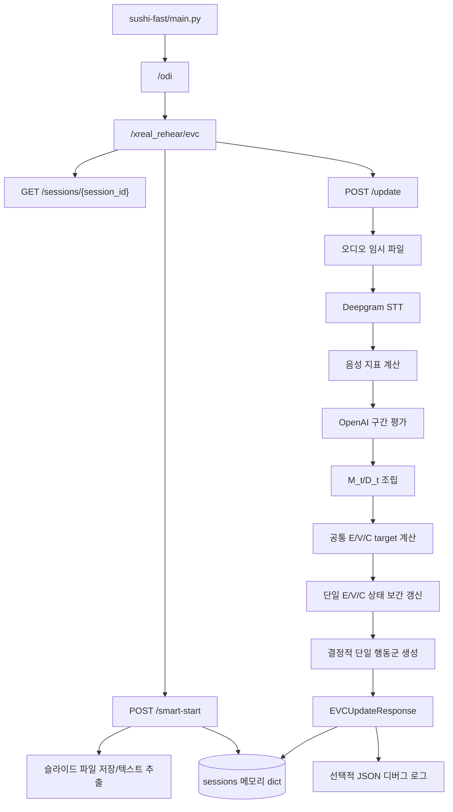

# AI 청중 반응 파이프라인 1단계 기준선 조사

> 기준 문서: `PROJECT_ONBOARDING.md`, `reaction-rule.md`, `reaction-rule_plan.md`  
> 조사 대상: 현재 워크트리의 정적 소스 및 추적 데이터  
> 단계 상태: 완료

## 1. 구현 경계

- 신규 개발 기준은 `sushi-fast/odi/EVC/`이다.
- `sushi-fast/odi/router.py`가 `odi.EVC.router`만 include하므로 실제 API 경로는 `/odi/xreal_rehear/evc/*`이다.
- `sushi-fast/odi/EVC/EVCv1/`은 어떤 상위 라우터에도 등록되지 않은 레거시 구현이다. 신규 코드에서 import하거나 두 세션 모델을 혼합하지 않는다.
- `sushi-app/src/routes/odi/GITA/`는 정적 화면·디자인 프로토타입 중심이며 현재 EVC API 호출부가 없다. 백엔드 파이프라인 구현 기준으로 사용하지 않는다.
- `sushi-app/src/routes/setup/[sessionId]`와 `src/lib/api/sessionApi.js`의 Unity 표기 흐름은 주석 처리된 `/odi/api/sessions/*` 백엔드 프로토타입을 호출하는 별도 레거시 경로다. EVC API와 연결되어 있지 않다.

## 2. 현재 API와 처리 흐름

### 2.1 엔드포인트

| 최종 경로 | 입력 | 현재 출력 | 상태 변경/부작용 |
| --- | --- | --- | --- |
| `POST /odi/xreal_rehear/evc/smart-start` | multipart: `presentation_title`, `topic_interest`, `prior_knowledge`, optional `slide_file` | session ID, 단일 초기 E/V/C, 설정값, 슬라이드 목록 | 업로드 파일 저장, 메모리 세션 생성 |
| `GET /odi/xreal_rehear/evc/sessions/{session_id}` | path session ID | 단일 E/V/C, step, 시각, 설정값, segment notes, 슬라이드 | 없음 |
| `POST /odi/xreal_rehear/evc/update` | multipart: session ID, audio, slide index, utterance position, language, optional gaze score | STT, 음성 지표, 평가, 단일 E/V/C, 단일 BehaviorCommand | 임시 오디오 생성/삭제, 외부 STT·LLM 호출, 메모리 상태 갱신, 로그 생성 |

현재 세 엔드포인트에는 인증·소유권 확인이 없다.

### 2.2 함수별 입력·출력·부작용

| 영역/함수 | 주요 입력 | 출력 | 부작용 또는 주의점 |
| --- | --- | --- | --- |
| `normalize_setting` | 문자열/숫자 설정값 | `0.0~1.0` float | 명세의 세 값 외 임의 숫자도 허용 |
| `initial_state_from_settings` | interest, knowledge | 단일 `AudienceState` | 에이전트별 오프셋 없음 |
| `save_upload_file` | UploadFile, 경로 | 저장 경로 | 전체 파일을 메모리에 읽고 상대 `evc_uploads`에 영구 저장, 크기/형식 제한 없음 |
| `create_smart_session` | 제목, 설정, optional slide | `EVCSession` | 업로드/추출 후 전역 `sessions` dict에 저장 |
| `extract_slides_from_file` | 저장 경로 | `SlideInfo[]` | PDF만 `pypdf`로 추출, PPT/PPTX는 placeholder |
| `get_session` | session ID | `EVCSession` | 없으면 `ValueError` |
| `save_audio_temp` | audio UploadFile | 임시 경로 | 전체 파일을 메모리에 읽음, 입력 제한 없음 |
| `get_slide_context` | session, slide index | 슬라이드 context dict | 범위 밖 index를 조용히 clamp |
| `compute_speech_metrics` | 표준 STT 결과 | `SpeechMetrics` | 결정적 순수 계산 |
| `compute_vocal_delivery_score` | 음성 지표 | `[-1,1]` 점수 | 임계값이 코드에 직접 포함됨 |
| `build_gpt_payload` | session, transcript, metrics, slide, 위치 | dict | 최근 note 8개 및 슬라이드 본문 포함 |
| `call_gpt_for_segment_evaluation` | payload 구성 입력 | `SegmentEvaluation` | import 시 생성된 OpenAI client로 외부 호출, timeout/retry/fallback 없음 |
| `assemble_mt_dt` | GPT 평가, 음성 지표, optional gaze | `MtDtEvaluation` | gaze 누락 시 0.0이나 `missing_inputs`에 자동 기록하지 않음 |
| `compute_evc_target` | `MtDtEvaluation` | 공통 `AudienceState` | 문서의 M/D 변환·통합 가중치는 대부분 구현됨 |
| `apply_evc_update` | 이전 상태, target, 설정 | 다음 단일 상태 | 명세의 가산식 대신 `move_toward` 보간 사용 |
| `level` | 상태값 | low/mid/high | `-0.34`가 현재 mid로 분류되어 문서 경계와 불일치 |
| `choose_dominant_axis` | 상태/절대값 | 축 | 직전 축을 받지 않으며 문서의 tie 우선순위와 불일치 |
| `generate_behavior` | 단일 상태, 발화 위치 | 단일 `BehaviorCommand` | 발화 위치를 실제로 사용하지 않고 Clip Pool/확률/쿨다운/Action 없음; 명세에 없는 `AL_05` 출력 가능 |
| `update_evc_from_audio` | update 입력 | `EVCUpdateResponse` | 전체 파이프라인 조립, 세션 동기화 없음; 빈 transcript는 step을 올리거나 로그를 남기지 않음 |
| `debug_save_step` | session, response, target | 없음 | `DEBUG_EVC_LOG` 기본 true, 상대 경로에 transcript/평가를 JSON으로 저장 |
| `speech_to_text_detail` | 오디오 경로, 언어 | `SpeechTextResult` | Deepgram 외부 호출, 파일 전체 로드, provider timeout/retry 없음 |

## 3. 재사용·교체·신규 구현 대상

### 재사용

- FastAPI 조립 경로: `main.py` → `odi/router.py` → `EVC/router.py`
- Pydantic 기반 요청/응답 검증 방식
- 슬라이드 context 구조와 PDF 페이지 단위 추출의 기본 골격
- Deepgram 결과를 transcript/word timing/confidence로 변환하는 로직
- 음성 지표 및 vocal delivery 계산의 기본 골격
- LLM이 E/V/C나 행동을 직접 만들지 않고 제한된 M/D 요소만 평가하는 프롬프트 방향
- `compute_evc_target`의 문서 기반 M/D 변환 및 통합 가중치
- 임시 오디오를 `finally`에서 삭제하는 구조

### 교체 또는 확장

- 단일 `AudienceState`/`BehaviorCommand`를 6명 개별 상태·프로파일·선택 결과·Unity 명령 구조로 확장
- 단일 `EVCSession`에 seed, 이전 우세축, 행동 이력, cooldown, 동시성 제어 추가
- `apply_evc_update`의 target 보간을 문서의 가산 갱신식으로 교체
- `level`, `choose_dominant_axis`, `generate_behavior`를 명세 기반 상태 분류·tie·Clip Pool 후보/확률 선택기로 교체
- update orchestration을 입력 정규화, 평가, 상태 계산, 행동 선택, Unity command 조립 모듈로 분리
- upload/STT/LLM 입력 제한, timeout, 오류 분류, fallback 추가
- 디버그 로그 기본값·경로·민감정보 정책 수정

### 신규 구현

- 6명 에이전트 프로파일과 seed 기반 초기 오프셋/행동 성향 생성
- 전체 Core/Action Clip Pool 및 고유 variation ID
- 사건 입력과 장면 gate
- 후보 score, 안정적 Softmax, Categorical 선택, no-op/fallback
- 행동 이력, 반복 페널티, cooldown, optional Action Overlay
- Face/Body/GazeHead 레이어 명령 분해와 `sync_group`
- 외부 서비스 없이 실행 가능한 단위/API 통합 테스트

## 4. 수정 예상 파일과 API 호환성 영향

| 예상 경로 | 예상 변경 | 호환성 영향 |
| --- | --- | --- |
| `sushi-fast/odi/EVC/schema.py` | 프로파일, 6명 상태, 사건, 후보 진단, Unity 명령 모델 추가 | 응답 확장; 기존 단일 필드를 유지할지 2단계에서 확정 필요 |
| `sushi-fast/odi/EVC/service.py` | orchestration 축소/재조립 | update 결과와 상태 의미 변경 |
| `sushi-fast/odi/EVC/router.py` | 신규 입력 필드·오류 계약·예제 | multipart 필드 추가 가능; 기존 필드는 유지 가능 |
| `sushi-fast/odi/EVC/speech2text.py` | provider 추상화와 오류/timeout | 정상 응답 형식은 유지 가능 |
| `sushi-fast/odi/EVC/` 신규 모듈 | state, evaluation, behavior, clip pool, command, session 책임 분리 | 내부 변경 |
| `sushi-fast/odi/EVC/` 설정 데이터 | 전체 Clip Pool/Unity mapping | Unity ID 계약 신규 추가 |
| `sushi-fast/odi/EVC/tests/` | 단위·통합 테스트 | 운영 API 영향 없음 |
| `.gitignore` 또는 로그 설정 | EVC 로그/업로드 제외와 보존 정책 | 운영 관측 방식 변경 |
| Python 의존성 명세 신규 파일 | 실행·테스트 버전 고정 | 배포 환경 변경 |

현재 GITA 또는 일반 Svelte 화면은 EVC API를 호출하지 않으므로 초기 백엔드 개발에서 수정 대상이 아니다. 실제 호출부가 확인되기 전 프런트 변경을 만들지 않는다.

## 5. 명세 대비 결손 체크리스트

- [ ] 청중 6명과 개별 `A_i,t`
- [ ] E/C 초기 랜덤 오프셋과 재현 seed
- [ ] Responsiveness, Expressivity, ChannelPreference, CriticalBias
- [ ] Has Laptop 및 좌석/뒷줄 장면 조건
- [x] Topic Interest/Prior Knowledge 정규화와 공통 초기 E/C 기본식
- [x] 제한된 M/D 요소를 LLM/음성/gaze로 조립하는 기본 구조
- [x] 내용·전달 요소의 delta 변환 및 차원별 통합 가중치 기본 구조
- [ ] 문서 그대로의 가산 E/V/C 갱신과 에이전트별 감소 민감도
- [ ] 정확한 상태 경계, 우세축, 방향, 근사 동률과 직전축 유지
- [ ] 전체 Core Behavior Clip Pool과 고유 variation 식별자
- [ ] 전체 Action Clip Pool, 사건 gate, 장면 gate
- [ ] utterance position에 따른 실제 후보 필터/start time
- [ ] 행동 이력, cooldown, 반복 페널티
- [ ] StateFit/Preference/ChannelPreference/History/Repetition 점수
- [ ] Softmax/Categorical 확률 선택 및 재현성
- [ ] Action Overlay 선택과 레이어 충돌 규칙
- [ ] Face/Body/GazeHead 명령 분해 및 `sync_group`
- [ ] API 인증/세션 소유권, 동시 update 안전성, 만료/복구 정책
- [ ] 외부 STT/LLM timeout/retry/fallback 및 테스트 대역
- [ ] 입력 크기·형식·슬라이드 index 검증
- [ ] 개인정보 최소화 로그 및 안전한 기본값
- [ ] EVC 전용 자동 테스트

## 6. 기존 로그와 데이터 상태

- `sushi-fast/odi/evc_logs`에 JSON 50개가 Git 추적 상태로 존재한다.
- 50개 모두 `latestSpeech`, `summary_before`, `gpt_output.audiences`를 가진 EVCv1 계열 형식이다.
- 현재 `debug_save_step`이 쓰는 `target_state` + `response` 형식의 샘플은 0개다.
- 따라서 기존 로그는 API 회귀 fixture가 아니며, 발표 내용이 들어 있을 가능성이 있는 민감 데이터로 취급한다.
- `.gitignore`는 `evc_logs/`, `evc_uploads/`, JSON 로그를 제외하지 않는다. 현재 코드의 로그·업로드 경로도 실행 CWD에 의존하는 상대 경로다.

## 7. 실행·테스트 기준선

조사 환경:

- Python: `3.13.3`
- Node.js: `v24.18.0`
- `sushi-app/node_modules`: 없음
- PowerShell에서 `npm.ps1`은 실행 정책으로 차단됨. 이후 필요하면 `npm.cmd`를 사용해야 한다.
- 저장소 전체 백엔드용 `requirements.txt`/`pyproject.toml`: 없음

현재 Python 환경의 import 상태:

| 패키지 | 상태 |
| --- | --- |
| fastapi | 미설치 |
| pydantic | 미설치 |
| openai | 미설치 |
| deepgram | 미설치 |
| pypdf/fitz 계열 | 미설치 |
| pytest | 미설치 |
| httpx | 설치 (`0.28.1`) |

검증 결과:

- `main.py`, `odi/router.py`, `odi/EVC/*.py`는 Python AST 구문 분석을 통과했다.
- 의존성 부재와 API key 없는 import 시 `OpenAI()` 생성 가능성 때문에 FastAPI 앱 기동/OpenAPI/pytest는 실행하지 못했다.
- EVC 전용 테스트는 존재하지 않는다. 저장소의 Python 테스트는 Bommal 및 Aura 실험 영역에만 있다.
- 프런트 의존성이 없어 `npm run check`는 실행할 수 없다.

## 8. 1단계 완료 판정

- 시작→갱신→응답 흐름을 엔드포인트, 함수, 스키마, 부작용 단위로 추적했다.
- 현재 구현과 EVCv1/GITA/레거시 Unity 경계를 확정했다.
- 재사용·교체·신규 구현 대상과 예상 변경 파일을 정리했다.
- API 호환성 위험과 명세 결손을 체크리스트로 정리했다.
- 테스트 가능 범위와 의존성 제약을 기록했다.

따라서 `reaction-rule_plan.md`의 1단계 완료 기준을 충족한다. 다음 실제 작업은 2단계인 미확정 정책과 데이터 계약 결정이다.
